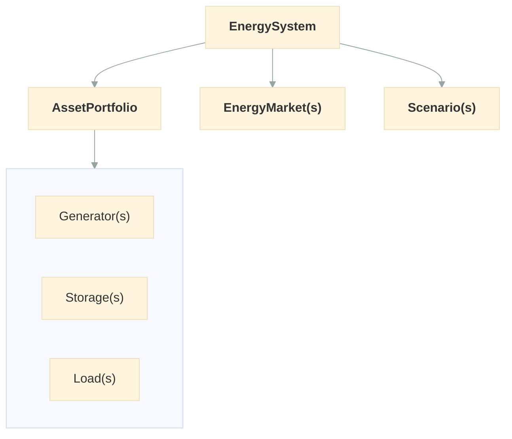

# EnergySystem

`EnergySystem` is the main entry point for setting up and running an optimization. Let's give it a portfolio of assets, scenario data, and time configuration -- then call `.optimize()`.

We designed `EnergySystem` as a single orchestrator because energy optimization involves multiple moving parts: assets, scenarios, time, and markets. Keeping them together in one object makes the workflow straightforward and validates everything at once.

Here's how the main objects relate to each other:



## Basic usage

Let's set up our first system.

```python
from datetime import timedelta

from odys import AssetPortfolio, EnergySystem, Generator, Load, Scenario

generator = Generator(name="gen", nominal_power=100.0, variable_cost=50.0)
load = Load(name="demand")

portfolio = AssetPortfolio()
portfolio.add_asset(generator)
portfolio.add_asset(load)

energy_system = EnergySystem(
    portfolio=portfolio,
    scenarios=Scenario(
        load_profiles={"demand": [60, 90, 40, 70]},
    ),
    timestep=timedelta(hours=1),
    number_of_steps=4,
)

result = energy_system.optimize()
```

## Constructor parameters

| Parameter         | Type                                             | Required | Default | Description                                              |
| ----------------- | ------------------------------------------------ | -------- | ------- | -------------------------------------------------------- |
| `portfolio`       | `AssetPortfolio`                                 | Yes      | -       | The collection of energy assets                          |
| `scenarios`       | `Scenario` or `list[StochasticScenario]`         | Yes      | -       | Scenario data (load profiles, prices, capacity profiles) |
| `timestep`        | `timedelta`                                      | Yes      | -       | Duration of each time period                             |
| `number_of_steps` | `int`                                            | Yes      | -       | How many timesteps to optimize over                      |
| `markets`         | `EnergyMarket` or `list[EnergyMarket]` or `None` | No       | `None`  | Energy markets for buying/selling                        |

## Scenarios

Use `Scenario` for deterministic problems. When you need to account for uncertainty, switch to `StochasticScenario`.

For a single deterministic scenario:

```python
from odys import Scenario

scenario = Scenario(
    load_profiles={"demand": [60, 90, 40, 70]},
    available_capacity_profiles={"gen": [100, 80, 100, 100]},
)
```

For stochastic optimization with multiple scenarios, pass a list of `StochasticScenario`:

```python
from odys import StochasticScenario

scenarios = [
    StochasticScenario(
        name="low_wind",
        probability=0.3,
        load_profiles={"demand": [80, 90, 70, 60]},
        available_capacity_profiles={"wind": [30, 20, 40, 25]},
    ),
    StochasticScenario(
        name="high_wind",
        probability=0.7,
        load_profiles={"demand": [80, 90, 70, 60]},
        available_capacity_profiles={"wind": [120, 140, 100, 130]},
    ),
]
```

See [Stochastic Optimization](stochastic.md) for more details.

## Adding markets

To include energy markets, pass them via the `markets` parameter:

```python
from odys import EnergyMarket

energy_system = EnergySystem(
    portfolio=portfolio,
    markets=(
        EnergyMarket(name="sdac", max_trading_volume_per_step=150),
        EnergyMarket(name="sidc", max_trading_volume_per_step=100),
    ),
    scenarios=scenario,
    timestep=timedelta(hours=1),
    number_of_steps=4,
)
```

Notice that market prices are specified in the scenario, not on the market object. We chose this design because prices vary over time and across scenarios, while market properties (like trading limits) stay fixed. Keeping time-varying data in scenarios keeps the model clean.

See [Market](market.md) for details.

## Running the optimization

Call `.optimize()` to build and solve the mathematical model:

```python
result = energy_system.optimize()
```

This returns an `OptimizationResults` object. See [Optimization](optimization.md) for how to read and interpret the results.

## What happens under the hood

When you call `.optimize()`, odys:

1. Validates the full system configuration (asset names match scenario profiles, probabilities sum to 1, etc.)
2. Builds a mixed-integer linear program (MILP) using linopy
3. Solves it with the HiGHS solver
4. Wraps the solution in an `OptimizationResults` object

You don't need to interact with any of these internals -- but if you're curious, the [API Reference](../api/energy_system.md) has the full details.

## Next steps

Now that you've seen the complete workflow, let's dive into each asset type. See [Generator](generator.md) to understand how to model power sources.
